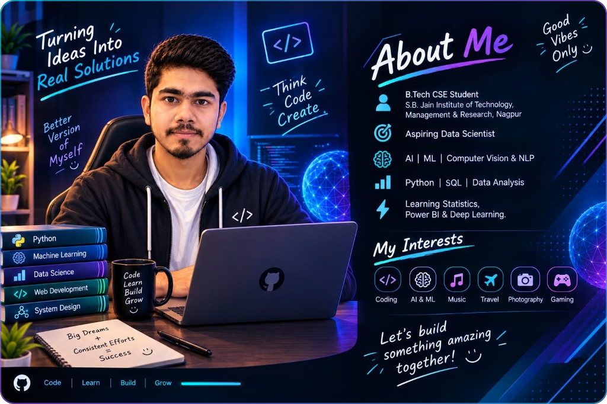
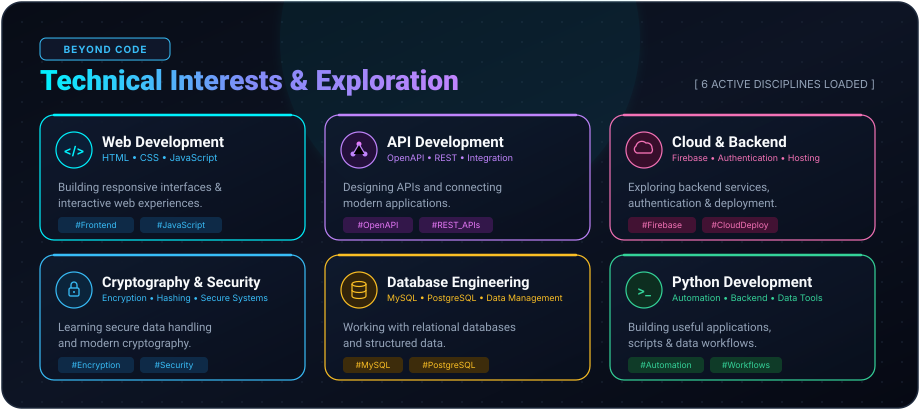
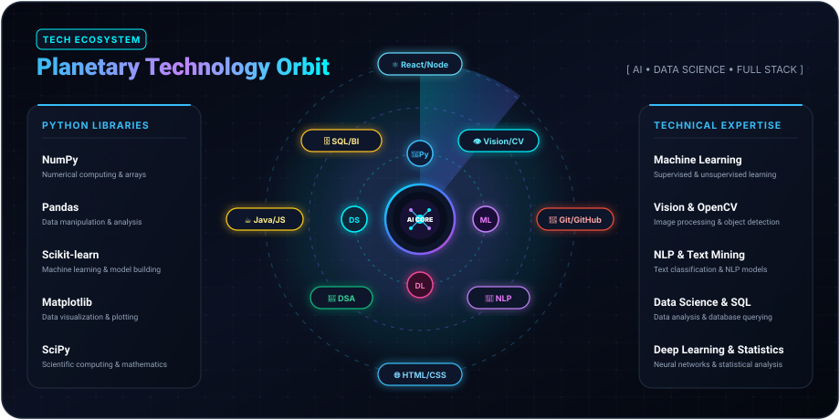

<!-- 1. HERO SECTION -->

  

<h1>👋 Hi there, I'm Yogesh Kadwe</h1>

  <b>🎓 B.Tech CSE Student</b> &nbsp;|&nbsp; <b>📊 Aspiring Data Scientist</b> &nbsp;|&nbsp; <b>🏛️ SBJITMR, Nagpur</b>

  <i>Passionate about Artificial Intelligence, Machine Learning, Computer Vision, and full-stack software development. Driven by transforming complex datasets into intelligent, real-world solutions and interactive applications.</i>

<!-- QUICK NAVIGATION -->

  
  
  
  
  

---

<!-- 2. ABOUT ME SECTION -->

---

<!-- 4. TECHNICAL INTERESTS SECTION -->

---

<!-- 5. TECHNOLOGY ORBIT SECTION -->

---

## 🛠️ Technical Arsenal

### 💻 Programming Languages

  
  
  
  
  
  
  

### 🌐 Frameworks, Backend & Databases

  
  
  
  
  

### 📊 AI, Data & Developer Tools

  
  
  
  
  
  
  

---

## 📊 GitHub Analytics & Activity

 

<!-- DYNAMIC GITHUB STATS -->
<table>
  <tr>
    <td width="50%" align="center">
      
    </td>
    <td width="50%" align="center">
      
    </td>
  </tr>
  <tr>
    <td colspan="2" align="center">
      
    </td>
  </tr>
</table>

 

<!-- GITHUB ACTIVITY GRAPH -->

---

## 🚀 Featured Projects

<!-- FLAGSHIP PROJECT: RecoverAI -->
<table>
  <tr>
    <td width="100%" valign="top">
      <h3>🏥 RecoverAI | AI-Powered Healthcare</h3>
      
<b>Smart • Secure • Real-Time Patient Recovery</b>

      
RecoverAI is an AI-powered healthcare platform designed to support post-operative patients during home recovery through intelligent monitoring, fall detection, health tracking, and caregiver alerts.

      <h4>✨ Key Highlights</h4>
      <ul>
        <li>🤖 <b>AI Fall Detection</b> — YOLOv8 Pose + Computer Vision for real-time hazard detection</li>
        <li>📹 <b>Real-Time Monitoring</b> — Live camera &amp; intelligent video stream analysis</li>
        <li>🚨 <b>Instant Alerts</b> — Automated caregiver notification for critical incidents</li>
        <li>💊 <b>Medicine &amp; Health Tracking</b> — Prescriptions, dosages &amp; vital recovery timelines</li>
        <li>📅 <b>Appointment Management</b> &amp; 🏃 <b>AI Physiotherapy Recovery Assistance</b></li>
        <li>👨‍⚕️ <b>Multi-Role Architecture</b> — Dedicated Patient, Caregiver &amp; Doctor Portals</li>
        <li>🔐 <b>Privacy-Focused</b> — End-to-end security designed for healthcare data</li>
      </ul>
      

        <code>React</code> <code>TypeScript</code> <code>Python</code> <code>Flask</code> <code>OpenCV</code> <code>YOLOv8</code> <code>Machine Learning</code> <code>MySQL</code> <code>Firebase</code>
      

      

        <i>💡 Turning healthcare monitoring into a smarter, faster and more connected recovery experience.</i>
      

      

        <a href="https://github.com/Yogesh-kadwe/Recover-AI"><b>View RecoverAI on GitHub ↗</b></a>
      

    </td>
  </tr>
</table>

 

<!-- OTHER FEATURED PROJECTS -->
<table>
  <tr>
    <!-- PROJECT 2: ArogyaBandhu -->
    <td width="50%" valign="top">
      <h3>🧠 ArogyaBandhu — AI Healthcare Platform</h3>
      
An intelligent AI-driven healthcare system designed to assist with health queries, medical information aggregation, and streamlined user assistance.

      

        <code>AI</code> <code>Machine Learning</code> <code>Python</code> <code>Healthcare Tech</code>
      

      

        <a href="https://github.com/Yogesh-kadwe"><b>Explore on GitHub ↗</b></a>
      

    </td>
    <!-- PROJECT 3: BracketBrain -->
    <td width="50%" valign="top">
      <h3>💼 BracketBrain</h3>
      
A smart technical project engineering algorithmic solutions, data modeling, and specialized computational workflows.

      

        <code>Python</code> <code>Algorithms</code> <code>Data Analysis</code> <code>Core Logic</code>
      

      

        <a href="https://github.com/Yogesh-kadwe"><b>Explore on GitHub ↗</b></a>
      

    </td>
  </tr>
  <tr>
    <!-- PROJECT 4: Process Scheduling Calculator -->
    <td width="50%" valign="top">
      <h3>📱 Process Scheduling Algorithms Calculator</h3>
      
An interactive computational tool simulating CPU scheduling algorithms (FCFS, SJF, Round Robin, Priority) with execution metrics and Gantt timelines.

      

        <code>Algorithms</code> <code>Operating Systems</code> <code>JavaScript / Python</code> <code>Computation</code>
      

      

        <a href="https://github.com/Yogesh-kadwe"><b>Explore on GitHub ↗</b></a>
      

    </td>
    <!-- PROJECT 5: To-Do App -->
    <td width="50%" valign="top">
      <h3>🌱 To-Do App</h3>
      
A clean and efficient task management application designed for productivity, tracking daily goals, priority levels, and task completion.

      

        <code>JavaScript</code> <code>HTML5</code> <code>CSS3</code> <code>Productivity</code>
      

      

        <a href="https://github.com/Yogesh-kadwe"><b>Explore on GitHub ↗</b></a>
      

    </td>
  </tr>
</table>

---

## 🐍 GitHub Contribution Grid Snake

 

<picture>
  <source media="(prefers-color-scheme: dark)" srcset="https://raw.githubusercontent.com/Yogesh-kadwe/Yogesh-kadwe/output/github-contribution-grid-snake-dark.svg">
  <source media="(prefers-color-scheme: light)" srcset="https://raw.githubusercontent.com/Yogesh-kadwe/Yogesh-kadwe/output/github-contribution-grid-snake.svg">
  
</picture>

---

<!-- 11. CONNECT SECTION -->

  

<!-- REAL SOCIAL LINKS & BUTTONS -->

  
  &nbsp;
  
  &nbsp;
  
  &nbsp;
  

---

<!-- 12. FINAL MESSAGE -->

  <h3>"Code Today, Create Tomorrow 🚀"</h3>
  <i>Built with ⚡ and futuristic aesthetics for <b>Yogesh Kadwe</b></i>

